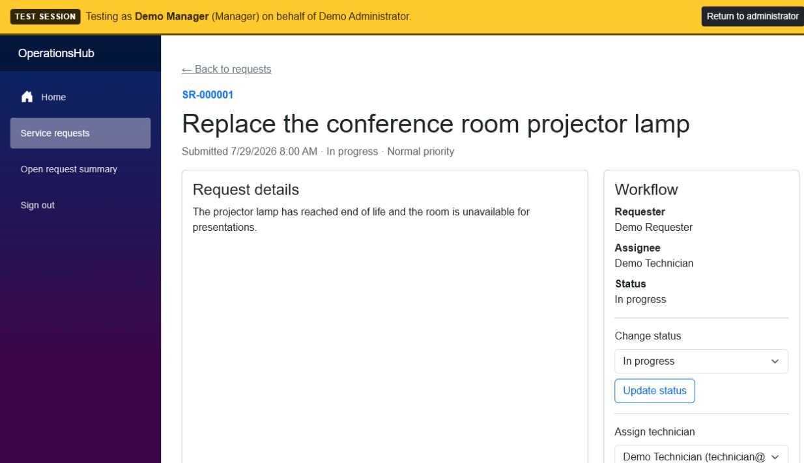
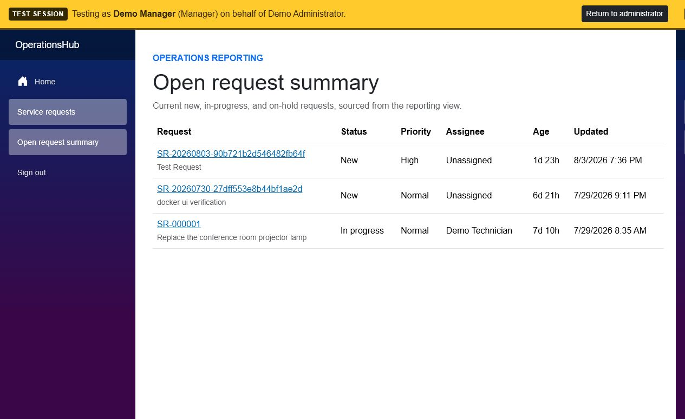

# OperationsHub

OperationsHub is an internal service-request and workflow-management application for submitting, assigning, tracking, and auditing operational work. It is a portfolio project designed to demonstrate senior-level, practical engineering with C#, ASP.NET Core, Blazor, relational data, APIs, security, testing, Docker, and technical documentation.

The project favors a complete modular monolith over microservices or speculative abstractions.

## Current status

**Milestones 0–7 are complete. Azure and all other live-production hosting work is Archived / not currently planned; it was deferred to avoid ongoing cloud costs for a portfolio project.**

The solution has a MySQL-backed EF Core context, ASP.NET Core Identity, Development-only demo identities, administrator-only reference-data management, and a complete service-request workflow. Requesters can submit, view, search, filter, and edit permitted requests; technicians work assigned requests; managers and administrators assign and oversee all requests. Assignment, status, comments, and audit history are retained with participant display names. Managers and administrators also have an open-request summary backed by a MySQL view. Development administrators can enter an audited test session as any active single-role non-administrator account and return through a persistent banner. Assignment uses a transactional stored procedure and all versioned request mutations detect stale edits. A multi-stage Linux image and full Docker Compose stack package the web host and MySQL for a one-command local demonstration.

## Technology

- .NET 10 and C#
- ASP.NET Core and Blazor Web App
- Global Interactive Server rendering
- MySQL 8.4 for local development
- Entity Framework Core and selected handwritten SQL, beginning in Milestone 1
- ASP.NET Core Identity, beginning in Milestone 1
- xUnit
- Docker Compose
- GitHub Actions for quality and local-container verification, with build-artifact publication to GitHub Container Registry

## Architecture

OperationsHub is split into four source projects:

```text
Web -> Infrastructure -> Application -> Domain
  \--------------------> Application
```

- **Domain** owns business entities and invariants.
- **Application** owns use cases, validation, DTOs, and contracts.
- **Infrastructure** implements database and external concerns.
- **Web** hosts the Blazor UI, REST API, middleware, and dependency composition.

See [docs/architecture.md](docs/architecture.md) and the records in [docs/decisions](docs/decisions).

## Quick start with Docker

The fastest portfolio-review path requires only Git, Docker Engine, and the Docker Compose plugin:

Before running these commands, start Docker Desktop on Windows or macOS, or start the Docker Engine service on Linux. Verify that the daemon is available with `docker info`; if Docker reports that it cannot connect to `dockerDesktopLinuxEngine` (Windows) or the Docker socket, the daemon is not running yet. On Docker Desktop installations that provide the Docker CLI extension, `docker desktop start` starts it; otherwise start Docker Desktop from the application menu.

```powershell
git clone https://github.com/mikefrawth/operations-hub.git
cd operations-hub
Copy-Item .env.example .env
docker compose up --build --detach
docker compose ps
```

When Docker is up and running, access the web application at `http://localhost:5090`. Compose builds the ASP.NET Core image, starts MySQL, waits for the database health check, starts the web container, applies pending migrations, and initializes the Development-only demo scenario. The demo accounts are listed under [Demo accounts](#demo-accounts).

After the image has been built, start the complete application again with `docker compose up --detach`. Add `--build` whenever the application source or Dockerfile changes. No local .NET SDK or `eng\dotnet` command is required for this Docker workflow.

Restarting Docker Desktop or existing containers does not rebuild the application image. After changing C#, Razor, or CSS files, run `docker compose up --build --detach web` so the web container includes the latest source and static assets.

Use `cp .env.example .env` instead of `Copy-Item` on Linux, macOS, or WSL. Stop the stack with `docker compose down`. The named database and Data Protection volumes survive normal shutdown.

If the browser reports an empty response, first run `docker info` to confirm that the Docker daemon is running. Then run `docker compose ps` and `docker compose logs web`. The `web` service must remain `Up` and become `healthy`; a `Restarting` status means startup failed and the logs contain the underlying error. If MySQL is still starting, wait until `docker compose ps` reports it as `healthy` before investigating the web logs.

## Optional native development workflow

Skip this entire section when running the application with Docker. It exists only for contributors who deliberately want to run the web process outside its container for `dotnet watch`, direct debugger integration, or repository test commands.

That optional workflow also requires:

- Linux, macOS, Windows, or WSL
- [.NET SDK 10.0.302](https://dotnet.microsoft.com/download/dotnet/10.0), or a compatible later 10.0 patch selected by `global.json`
- Docker Engine with the Compose plugin
- Git

Use `eng\dotnet.cmd` from native Windows PowerShell and `eng/dotnet.sh` from Bash. The Windows entry point invokes `eng\dotnet.ps1` with a process-scoped execution-policy bypass, so it works without changing machine or user policy. Each wrapper uses the platform-appropriate repository-local `.dotnet` SDK when one exists and otherwise delegates to `dotnet` on `PATH`. Both wrappers isolate CLI/package caches inside the repository and use the committed `NuGet.Config`; the PowerShell wrapper also normalizes duplicate `Path`/`PATH` variables that some sandboxed Windows environments provide.

### 1. Initialize the native toolchain

Run these commands once when choosing to run the web host directly:

```powershell
git clone https://github.com/mikefrawth/operations-hub.git
cd operations-hub
Copy-Item .env.example .env
docker compose up -d mysql
docker compose ps
.\eng\dotnet.cmd restore
```

The copied `.env` file contains local-development settings for Docker Compose and is ignored by Git. The web host's committed Development connection string matches the example defaults and disables TLS only for the loopback Docker connection. If you change the database user, password, port, or database name in `.env`, also provide a matching `ConnectionStrings__OperationsHub` environment variable when running the web host. `docker compose ps` shows whether MySQL has reached a healthy state. Restore downloads the NuGet dependencies required by the solution.

### 2. Build and run the web host natively

In this optional mode, Docker runs only MySQL and the .NET wrapper runs the web host:

```powershell
docker compose up -d mysql
.\eng\dotnet.cmd build --no-restore
.\eng\dotnet.cmd run --project src/OperationsHub.Web
```

Open `http://localhost:5090`. Stop the application with <kbd>Ctrl</kbd>+<kbd>C</kbd>.

Run `.\eng\dotnet.cmd restore` again after pulling changes that modify project files or NuGet dependencies. The `--no-restore` build option keeps the normal build fast by using dependencies that were already restored.

### 3. Develop natively with automatic rebuilds

Use `dotnet watch` while actively changing C# or Razor files:

```powershell
docker compose up -d mysql
.\eng\dotnet.cmd watch --project src/OperationsHub.Web
```

The watch process monitors supported source files, rebuilds the affected project, and refreshes or restarts the application when changes are detected. Keep it running during development and stop it with <kbd>Ctrl</kbd>+<kbd>C</kbd>. Open `http://localhost:5090` after the application reports that it is listening.

Run either the normal `run` command or the `watch` command at one time. Both use port `5090`, so the second process will report that the address is already in use.

### Optional HTTPS profile

The default development profile intentionally uses HTTP so it works cleanly across WSL and the Windows host browser. To use the HTTPS development profile, run:

```powershell
.\eng\dotnet.cmd run --project src/OperationsHub.Web --launch-profile https
```

The HTTPS profile listens on `https://localhost:7090` and also exposes `http://localhost:5090`. The committed values in `.env.example` are isolated-development examples only.

## Docker operations

The default Compose project runs the complete application. The web container listens on host port `5090`, and MySQL listens on host port `3307` so native development and integration tests can reach the same database.

```bash
docker compose config
docker compose up --build --detach
docker compose ps
docker compose logs --follow web
docker compose logs mysql
docker compose down
```

Rebuild after changing application source or the Dockerfile:

```bash
docker compose up --build --detach web
```

The image health check verifies both process liveness and delivery of the Blazor framework script required for interactive buttons and forms.

For native web development, start only MySQL with `docker compose up -d mysql`. To remove both local named volumes, including all database data and persisted local sign-in keys:

```bash
docker compose down --volumes
```

This reset is destructive and intended only for disposable local development data. See [docs/deployment.md](docs/deployment.md) for the local image contract, health endpoints, temporary demonstration workflow, and the clearly separated archive of the former hosted-production design.

## Contributor build, test, and format

These commands verify source changes outside the application container. They are not required to start the Docker Compose application.

```powershell
.\eng\dotnet.cmd restore
.\eng\dotnet.cmd build --no-restore
.\eng\dotnet.cmd test --no-build
.\eng\dotnet.cmd format --verify-no-changes --no-restore
```

Warnings and recommended analyzer findings fail the build.

On Linux, macOS, or WSL, replace `.\eng\dotnet.cmd` with `./eng/dotnet.sh`.

The integration test project uses real MySQL. For native test runs, start the disposable database with `docker compose up -d mysql` first; GitHub Actions provisions the same MySQL 8.4 service on port `3307` before running the solution tests. CI also exercises migration-only mode against a fresh database before Development startup and verifies that it does not create reusable demo credentials, demo role assignments, or the portfolio request.

### Verified Windows-native commands

The native .NET commands below were reverified successfully in Windows PowerShell on 2026-08-05. In Codex, the wrapper detects `CODEX_CI` or `CODEX_THREAD_ID`, disables build servers, and uses one MSBuild node to avoid sandbox IPC limitations.

```powershell
.\eng\dotnet.cmd restore OperationsHub.sln --verbosity minimal
.\eng\dotnet.cmd build OperationsHub.sln --no-restore --verbosity minimal
.\eng\dotnet.cmd test OperationsHub.sln --no-build --no-restore --verbosity minimal
.\eng\dotnet.cmd format OperationsHub.sln --verify-no-changes --no-restore --verbosity minimal
docker compose config
docker compose build web
docker compose up --detach
docker compose ps
docker compose run --rm web --migrate
```

The build completed with zero warnings and errors, all 34 tests passed, and formatting required no further changes. The container sequence was reverified in an isolated Compose project: the web image built successfully; migration-only mode completed against a fresh database without creating reusable demo credentials, demo role assignments, or the portfolio request; both services reported healthy; `/health/live` and `/health/ready` returned HTTP `200`; and the landing page and Blazor framework asset loaded successfully.

## Database migrations and seed data

Development startup applies migrations automatically. For native tooling, restore the repository-pinned EF tool and apply migrations with:

```powershell
.\eng\dotnet.cmd tool restore
.\eng\dotnet.cmd tool run dotnet-ef database update `
  --project src/OperationsHub.Infrastructure `
  --startup-project src/OperationsHub.Web
```

The remediation migration removes role assignments and disables the fixed demo identities that the initial migration historically created. The web host recreates their password and role assignments only when it starts in the Development environment. See [docs/database.md](docs/database.md) for the schema, ER diagram, migration behavior, and seed data.

The container image also provides a migration-only mode that does not start the HTTP server or initialize Development demo accounts:

```bash
docker compose run --rm web --migrate
```

CI verifies this mode against a fresh disposable Compose database before Development startup. The archived hosting design retained it as a possible one-shot schema migration mechanism, but no live release currently uses it.

## Demo accounts

Development-only Requester, Technician, Manager, and Administrator accounts are created at Development startup with password `OperationsHub!2026`. They have lockout enabled and are never part of the current EF model seed. See [docs/database.md](docs/database.md) for their email addresses. These public credentials are suitable only for an isolated local environment.

After signing in as the Administrator, open **Test as another user** in the navigation to assume a Requester, Technician, or Manager profile without entering another password. A yellow banner stays at the top of the screen, identifies the effective profile on every page, and returns to the original administrator in one click. Signing out from the side navigation during a test session ends the tested profile session and restores the administrator. Start and end transitions are audited. This feature is mapped and authorized only in Development.

## API antiforgery

The reference-data API uses the same cookie authentication as the Blazor UI. After signing in, a non-browser client must retain the authentication and antiforgery cookies, request `GET /api/antiforgery`, and send the returned request token in the returned header name for every `POST` or `PUT` request. Missing or invalid tokens are rejected before endpoint code runs.

## Feature status

| Capability | Status |
| --- | --- |
| Modular solution and Blazor host | Implemented in Milestone 0 |
| Local MySQL infrastructure | Implemented in Milestone 0 |
| Identity and demo users | Implemented in Milestone 1 |
| Department and request-type administration | Implemented in Milestone 2 |
| Service-request workflow and REST API | Implemented in Milestone 3 |
| Reporting view, stored procedure, and concurrency | Implemented in Milestone 4 |
| Development administrator impersonation | Implemented in Milestone 5 |
| Engineering hardening | Completed in Milestone 5 |
| Container delivery | Dockerfile and full Compose stack implemented for Milestone 6 |
| CI and local container verification | Implemented in Milestone 6 |
| Department performance reporting and CSV export | Implemented in Milestone 7 |
| Azure or other live-production hosting | **Archived / not currently planned** to avoid ongoing portfolio-project cloud costs |

See [docs/roadmap.md](docs/roadmap.md) for the complete sequence.

## Screenshots

The Development portfolio scenario demonstrates an assigned request with status, comments, assignment history, and role-aware controls.



The Manager reporting view is backed by `vw_open_request_summary` and resolves assignee display names without exposing Identity persistence to the UI. Department performance is available at `/reports/department-performance`, with a browser-authenticated CSV export at `/api/reports/department-performance.csv`.



See the [Milestone 5 engineering-hardening review](docs/engineering-hardening-review.md) for the completed security, accessibility, performance, test, and browser-verification checks.

## Portfolio demonstration

Docker Compose is the supported way to run and demonstrate the complete application, including MySQL. There is no active Azure or other live hosted environment, and cloud provisioning is not a prerequisite, next milestone, deployment step, or definition-of-done item.

For a scheduled remote demonstration, start the local stack from the repository root:

```powershell
Copy-Item .env.example .env
docker compose up --build --detach
docker compose ps
```

Use `cp .env.example .env` for the first command on Linux, macOS, or WSL. Confirm that both services are healthy and that `http://localhost:5090/health/ready` succeeds. The default web port is `5090`, from the Compose mapping `${APP_PORT:-5090}:8080`.

With `cloudflared` installed, start a Quick Tunnel in a separate terminal:

```bash
cloudflared tunnel --url http://localhost:5090
```

If `APP_PORT` overrides the default, use the mapped host port in the same command:

```text
cloudflared tunnel --url http://localhost:<web-port>
```

Share the generated random `https://...trycloudflare.com` URL only with the scheduled attendees and only for the duration of the demonstration. A Quick Tunnel is not a production deployment: it has no uptime guarantee, its URL changes when restarted, and the demo laptop must remain awake with Docker Compose and `cloudflared` running. Do not publish the URL, expose `.env` or other sensitive configuration, or make the Development-only demo accounts available outside the controlled session. Keep a short recorded walkthrough as a backup.

Immediately after the demonstration, stop `cloudflared` with <kbd>Ctrl</kbd>+<kbd>C</kbd>, then stop the local stack:

```bash
docker compose down
```

The former Azure/live-production plan is preserved only as an archived future option in [docs/deployment.md](docs/deployment.md) and [decision 0011](docs/decisions/0011-local-portfolio-demonstration.md).

## Known limitations

- The development sign-in screen uses an antiforgery-protected HTTP form and supports the Development-only demo accounts. Sign-in attempts are limited per remote IP, accounts lock for 15 minutes after five failed attempts, and registration, password recovery, multifactor authentication, and a non-Development identity provider are outside the active portfolio scope.
- Administrator impersonation is Development-only and accepts only active accounts with exactly one Requester, Technician, or Manager role. A non-Development support impersonation path is intentionally not implemented.
- Managers and administrators can assign requests only to active technicians selected from the technician directory.
- Development startup creates a deterministic in-progress request assigned to the demo Technician, with comments, status history, assignment history, and audit events so every permitted role has a populated local demonstration path.
- The unauthenticated `/health` and `/health/ready` endpoints check database connectivity; `/health/live` checks only whether the web process can serve requests. The host writes structured JSON logs and returns safe error responses through centralized exception handling.
- Compose intentionally runs the web host in `Development` for disposable local demonstrations. Migration-only mode never initializes the public demo identities.
- Compose stores unencrypted Data Protection keys in a private local named volume for restart-stable demo sessions; this local configuration must not become a persistent public environment.
- Azure and other live-production hosting are Archived / not currently planned. The optional Quick Tunnel is temporary, has a changing URL and no uptime guarantee, and depends on the demo laptop remaining online.
- Integration tests cover migrations, Development-only identity initialization and impersonation eligibility, security endpoint metadata, reference-data administration, and the MySQL reporting/transaction/concurrency workflow.

## License

OperationsHub is available under the [MIT License](LICENSE).
