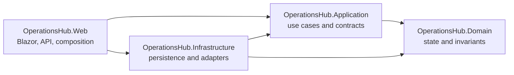

# Architecture

## Context

OperationsHub coordinates internal service requests across requesters, technicians, managers, and administrators. The system needs transactional consistency, explicit authorization, auditability, relational reporting, and a UI/API surface while remaining understandable in a portfolio review.

## Modular-monolith rationale

A modular monolith keeps request, assignment, status, comment, and audit operations in one deployable transaction boundary. It avoids distributed failure modes and operational overhead that the current scope does not justify. Project boundaries preserve separation of concerns and create seams that could support later extraction if load, ownership, or deployment needs materially diverge.

Dependency direction is enforced by project references and foundation tests:

- Domain has no OperationsHub project dependency.
- Application depends only on Domain.
- Infrastructure depends on Application and Domain.
- Web depends on Application and Infrastructure and is the composition root.

## Layer responsibilities

### Domain

Owns entities, value objects that provide clear benefit, stable enumerations, transition rules, and domain exceptions. It remains independent of EF Core, ASP.NET Core, Identity, and MySQL.

### Application

Owns commands, queries, validation, DTOs, mapping, authorization-aware use cases, and contracts implemented by Infrastructure. Operations define transaction boundaries when multiple writes must succeed atomically.

### Infrastructure

Owns DbContext, entity configurations, Identity persistence, migrations, MySQL-specific queries, stored-procedure calls, transaction implementations, clocks, storage, and external adapters.

### Web

Owns Blazor components, REST endpoints, authentication configuration, middleware, dependency injection, OpenAPI, and safe error handling. It translates transport concerns and delegates business operations to Application.

## Rendering and UI

The Blazor Web App uses global Interactive Server rendering. This provides a cohesive server-side security and data-access model for an internal tool while retaining an interactive component experience. The tradeoff is a live server circuit per connected user and a stronger requirement for connection resilience and server capacity.

Bootstrap is sufficient for the MVP. Components should prioritize accessibility, clear states, and task completion over custom design-system work.

## Planned request lifecycle

Beginning in Milestone 3, a request will move through explicit submitted, triaged, in-progress, blocked, resolved, closed, or cancelled states. Application operations will enforce actor permissions and domain transition rules. Successful assignment and status changes will update current state and append history/audit records in one transaction.

## Authentication and authorization

ASP.NET Core Identity will be introduced in Milestone 1 with Requester, Technician, Manager, and Administrator roles. UI visibility will improve usability, but Application/Web server boundaries will enforce ownership, assignment, department, and administrative access. Public registration is not part of the initial plan.

## Data access

EF Core will handle aggregate persistence, relationship mapping, migrations, and routine queries. Handwritten parameterized MySQL SQL will be used selectively where a reporting view, stored procedure, or database-specific query is the clearest enterprise demonstration. EF entities will not cross API boundaries.

This mixed approach demonstrates both maintainable application persistence and deliberate database capability without forcing ordinary CRUD through procedures.

## Major tradeoffs

- A modular monolith trades independent deployment for simpler consistency and operations.
- Interactive Server trades offline/client execution for centralized security and a smaller browser payload.
- MySQL enables substantive relational and SQL work but makes real-container integration tests necessary.
- Explicit application services add some mapping code but keep UI, persistence, and business rules separated.
- Soft deactivation preserves history at the cost of consistently filtering active reference data.

## Future scaling path

Scale vertically and with multiple web instances first, accounting for Blazor circuit affinity or backplane needs. Optimize indexed queries and reporting projections before splitting services. If a module later develops independent ownership, scaling, or deployment requirements, extract it behind an existing Application contract and use an outbox-backed integration boundary rather than sharing database tables.
