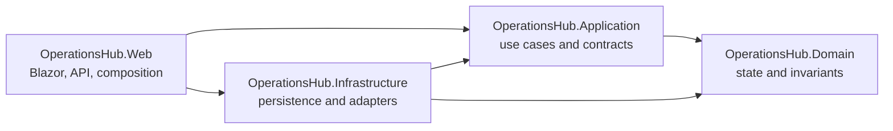
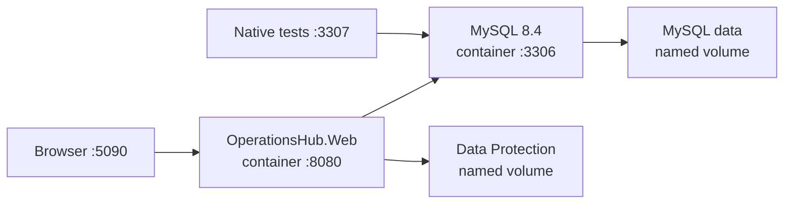

# Architecture

## Context

OperationsHub coordinates internal service requests across requesters, technicians, managers, and administrators. The system needs transactional consistency, explicit authorization, auditability, relational reporting, and a UI/API surface while remaining understandable in a portfolio review.

## Modular-monolith rationale

A modular monolith keeps request, assignment, status, comment, and audit operations in one deployable transaction boundary. It avoids distributed failure modes and operational overhead that the current scope does not justify. Project boundaries preserve separation of concerns and create seams that could support later extraction if load, ownership, or deployment needs materially diverge.

Dependency direction is enforced by project references and foundation tests:

- Domain has no OperationsHub project dependency.
- Application depends only on Domain.
- Infrastructure depends on Application and Domain.
- Web depends on Application and Infrastructure and is the composition root.

## Layer responsibilities

### Domain

Owns entities, value objects that provide clear benefit, stable enumerations, transition rules, and domain exceptions. It remains independent of EF Core, ASP.NET Core, Identity, and MySQL.

### Application

Owns commands, queries, validation, DTOs, mapping, authorization-aware use cases, and contracts implemented by Infrastructure. Operations define transaction boundaries when multiple writes must succeed atomically.

### Infrastructure

Owns DbContext, entity configurations, Identity persistence, migrations, MySQL-specific queries, stored-procedure calls, transaction implementations, clocks, storage, and external adapters.

### Web

Owns Blazor components, REST endpoints, authentication configuration, middleware, dependency injection, OpenAPI, and safe error handling. It translates transport concerns and delegates business operations to Application.

The host writes structured JSON logs, records unhandled request failures with their method and path, uses centralized exception handling, returns RFC 7807 Problem Details for API failures, and exposes an anonymous `/health` endpoint backed by the EF Core database check.

## Container runtime and delivery

The web host is published as one Linux container image through a pinned multi-stage Dockerfile. The same image serves requests normally or runs as a one-shot `--migrate` task. Migration-only mode applies EF Core migrations and exits before the middleware pipeline starts; it does not initialize Development demo identities. CI verifies this capability against the disposable Compose database, and it remains useful architecture if hosting is reconsidered later.

Docker Compose supplies the local portfolio topology:

The Compose web service runs as a non-root user with a read-only root filesystem, waits for healthy MySQL, and persists Data Protection keys separately from the image. `/health/live` checks only the process; `/health/ready` and the existing `/health` endpoint include database connectivity. Local Docker Compose is the supported application and MySQL topology. For a scheduled remote demo, only host port `5090` may be exposed temporarily through a Cloudflare Quick Tunnel; this is not a hosted production environment. Azure and other live hosting are **Archived / not currently planned** to avoid ongoing portfolio-project cloud costs. See [deployment.md](deployment.md), [decision 0008](decisions/0008-container-delivery-and-explicit-migrations.md), and [decision 0011](decisions/0011-local-portfolio-demonstration.md).

## Rendering and UI

The Blazor Web App uses global Interactive Server rendering. This provides a cohesive server-side security and data-access model for an internal tool while retaining an interactive component experience. The tradeoff is a live server circuit per connected user and a stronger requirement for connection resilience and server capacity.

Bootstrap is sufficient for the MVP. Components should prioritize accessibility, clear states, and task completion over custom design-system work.

## Request lifecycle

Milestone 3 uses the persisted states `New`, `InProgress`, `OnHold`, `Resolved`, and `Closed`. Domain methods allow only deliberate transitions; Application use cases enforce actor permissions and validate that an assignee is an active Technician. Successful assignment and status changes update current state and append history/audit records in the same transaction.

Milestone 4 retains EF Core for ordinary request operations but demonstrates selected MySQL concerns explicitly. The reporting summary is read from `vw_open_request_summary` through a parameterized database command. Manager/administrator assignment calls `sp_assign_request`, which locks the request, performs the current-row and append-only-history writes in one transaction, and reports a stale version without a partial commit. The Application layer exposes only outcome DTOs, keeping MySQL command and procedure details in Infrastructure.

## Authentication and authorization

ASP.NET Core Identity provides Requester, Technician, Manager, and Administrator roles with an HTTP-only, same-site cookie. A single claims mapper converts recognized roles into Application actors, while endpoint/page policies reject authenticated accounts with no OperationsHub role. UI visibility improves usability, while the Web server boundary enforces access. Cookie-authenticated JSON mutations explicitly validate antiforgery state before invoking application code. Sign-in is throttled per remote IP, request classification is throttled per authenticated user, failed-password attempts lock eligible accounts, and unsafe return URLs are rejected. Public registration is not part of the initial plan.

Forwarded headers remain disabled by default. Enabling them requires at least one explicit `ReverseProxy:KnownProxies` IP address and accepts only one forwarding hop because the resulting client IP is used for authentication throttling and impersonation audit context.

Fixed demo identities are a Development-only runtime concern. The current EF model seeds stable roles and reference data, but not users or password hashes. The remediation migration disables the historical demo identities for migration-only and non-Development runs; guarded Development startup restores the local demo password and role assignments.

Development administrators can start an audited test session as an active account with exactly one Requester, Technician, or Manager role. The target Identity principal receives only that effective role; protected cookie claims retain the original administrator identity for the persistent return banner. Start and return are antiforgery-protected POST operations, return revalidates the original Administrator role, and neither the endpoints nor navigation are mapped outside Development. Normal workflow audit entries identify the effective target user, while paired impersonation events identify the initiating administrator. See [decision 0009](decisions/0009-development-administrator-impersonation.md).

Managers and administrators select assignees from an Infrastructure-backed technician directory exposed through an Application contract. Assignment validation still checks the selected Identity user on the server before the transactional procedure runs.

Request detail and reporting components resolve the bounded set of visible participant IDs through a separate Application directory contract. Infrastructure implements that lookup with a no-tracking Identity query, so Razor components display names without referencing `ApplicationUser`, EF Core, or the DbContext.

## Data access

EF Core will handle aggregate persistence, relationship mapping, migrations, and routine queries. Handwritten parameterized MySQL SQL will be used selectively where a reporting view, stored procedure, or database-specific query is the clearest enterprise demonstration. EF entities will not cross API boundaries.

This mixed approach demonstrates both maintainable application persistence and deliberate database capability without forcing ordinary CRUD through procedures.

Milestone 7 introduces `IRequestReportingService` and `IReportingStore` for manager/administrator reporting. Infrastructure reads the stable `vw_department_performance` view and returns Application DTOs; the Blazor page and the read-only JSON/CSV endpoints do not depend on EF Core or MySQL types. This makes the CSV export an immediately usable Power BI import surface without introducing a second reporting implementation.

## Major tradeoffs

- A modular monolith trades independent deployment for simpler consistency and operations.
- Interactive Server trades offline/client execution for centralized security and a smaller browser payload.
- MySQL enables substantive relational and SQL work but makes real-container integration tests necessary.
- Explicit application services add some mapping code but keep UI, persistence, and business rules separated.
- Soft deactivation preserves history at the cost of consistently filtering active reference data.
- Development-only impersonation speeds role verification but deliberately does not provide a non-Development support-access path.
- One immutable container image simplifies delivery, while explicit migrations add a required release step.

## Archived future hosted-scaling option

**Status: Archived / not currently planned.** If live hosting is deliberately reconsidered in a future decision, scale vertically and with multiple web instances first, accounting for Blazor circuit affinity, shared Data Protection keys, and session affinity or backplane needs. Optimize indexed queries and reporting projections before splitting services. If a module later develops independent ownership, scaling, or deployment requirements, extract it behind an existing Application contract and use an outbox-backed integration boundary rather than sharing database tables.
