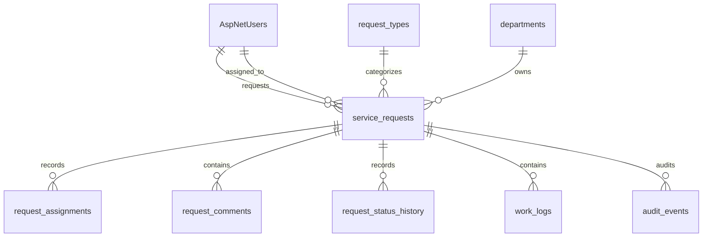

# Database design

## Current state

Milestone 1 establishes MySQL 8.4 persistence through EF Core 10 and MySQL Connector/NET's `MySql.EntityFrameworkCore` provider. The initial migration is [20260729003606_InitialDatabaseAndIdentity.cs](../src/OperationsHub.Infrastructure/Persistence/Migrations/20260729003606_InitialDatabaseAndIdentity.cs); EF migrations are the source of truth for application schema evolution.

In Development, the web host applies pending migrations at startup. Production migration execution is deliberately deferred to deployment automation.

## Schema



Identity supplies `AspNetUsers`, `AspNetRoles`, and its supporting tables. Application tables use lowercase snake case: `departments`, `request_types`, `service_requests`, `request_assignments`, `request_comments`, `request_status_history`, `work_logs`, and `audit_events`.

All application timestamps are UTC `datetime(6)`. Referenced records use restrictive foreign keys, so no request or audit history can be removed by a cascade. Departments and request types have `is_active`; Milestone 2 administrators can deactivate them while retaining the row and its historical relationships. Names remain unique even after deactivation, so a retired name cannot be reused. `service_requests.version` is configured as EF's concurrency token; the update workflow that increments and returns it arrives in Milestone 4.

Indexes cover identity lookup, unique department/request-type names, request number, request list filters, foreign keys, and chronological history access.

## Development seed data

The migration seeds two departments, two request types, and these development-only accounts. Each account uses password `OperationsHub!2026`.

| Role | Email |
| --- | --- |
| Requester | requester@operationshub.local |
| Technician | technician@operationshub.local |
| Manager | manager@operationshub.local |
| Administrator | administrator@operationshub.local |

These credentials are intentionally public development fixtures and must never be deployed.

## Reference-data administration

The Administrator role can create, list, rename, and deactivate departments and request types at `/administration/reference-data`. The local `/sign-in` page posts credentials through an antiforgery-protected HTTP request, which safely establishes the cookie-backed session for the seeded demo users. Authorization redirects browser requests there, while `/api` requests receive normal `401` or `403` responses. The same service is exposed through administrator-only endpoints under `/api/reference-data`. API list endpoints accept `activeOnly=true` to exclude deactivated records; the administration page shows both active and inactive records. Server-side validation trims names, requires a non-empty name of at most 100 characters, rejects duplicate names, and limits optional request-type descriptions to 500 characters.

## Commands

```bash
./eng/dotnet.sh tool restore
./eng/dotnet.sh tool run dotnet-ef database update \
  --project src/OperationsHub.Infrastructure \
  --startup-project src/OperationsHub.Web
```

To add a future migration, use the same command structure with `migrations add <MigrationName>` and `--output-dir Persistence/Migrations`. Milestone 2 changed only application behavior and therefore did not require a new schema migration. The MySQL integration tests need the Compose service running at port 3307, or an `OPERATIONS_HUB_TEST_CONNECTION` override.

## Views and stored procedures

Milestone 4 will add `vw_open_request_summary` and `sp_assign_request`. Ordinary CRUD remains in EF Core; selected reporting and transactional demonstrations will use parameterized SQL and integration tests.
