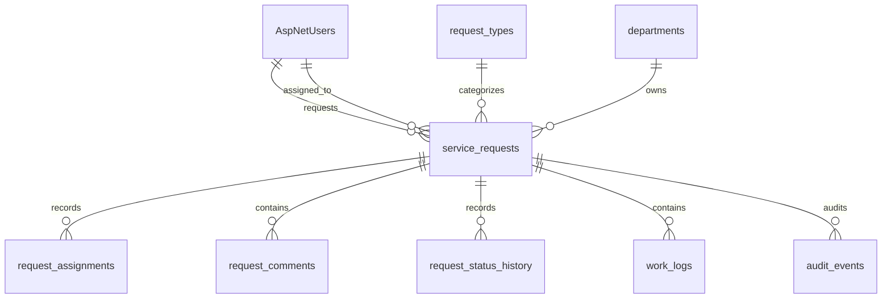

# Database design

## Current state

Milestone 1 established MySQL 8.4 persistence through EF Core 10 and MySQL Connector/NET's `MySql.EntityFrameworkCore` provider. The initial migration is [20260729003606_InitialDatabaseAndIdentity.cs](../src/OperationsHub.Infrastructure/Persistence/Migrations/20260729003606_InitialDatabaseAndIdentity.cs). The Milestone 2 security review added [20260729101935_RemoveDemoIdentityFromSchemaSeed.cs](../src/OperationsHub.Infrastructure/Persistence/Migrations/20260729101935_RemoveDemoIdentityFromSchemaSeed.cs). Milestone 4 adds [20260729113818_AddRequestReportingAndAssignmentProcedure.cs](../src/OperationsHub.Infrastructure/Persistence/Migrations/20260729113818_AddRequestReportingAndAssignmentProcedure.cs). EF migrations remain the source of truth for application schema evolution.

In Development, the web host applies pending migrations, initializes demo identities, and creates an idempotent portfolio request at startup. Production migration execution is deliberately deferred to deployment automation, and non-development configuration must supply `ConnectionStrings__OperationsHub`.

## Schema



Identity supplies `AspNetUsers`, `AspNetRoles`, and its supporting tables. Application tables use lowercase snake case: `departments`, `request_types`, `service_requests`, `request_assignments`, `request_comments`, `request_status_history`, `work_logs`, and `audit_events`.

All application timestamps are UTC `datetime(6)`. Referenced records use restrictive foreign keys, so no request or audit history can be removed by a cascade. Departments and request types have `is_active`; Milestone 2 administrators can deactivate them while retaining the row and its historical relationships. Names remain unique even after deactivation, so a retired name cannot be reused. `service_requests.version` is configured as EF's concurrency token; the update workflow that increments and returns it arrives in Milestone 4.

Indexes cover identity lookup, unique department/request-type names, request number, request list filters, foreign keys, and chronological history access. `IX_service_requests_status_updated_at_utc` supports the open-request reporting view's status filter and descending recency ordering.

## Development seed data

The EF model seeds two departments and two request types. Development startup creates or restores the following local demo accounts with password `OperationsHub!2026`:

| Role | Email |
| --- | --- |
| Requester | requester@operationshub.local |
| Technician | technician@operationshub.local |
| Manager | manager@operationshub.local |
| Administrator | administrator@operationshub.local |

These credentials are intentionally public development fixtures. They have failed-attempt lockout enabled and must never be deployed. The remediation migration removes their role assignments, clears their password hashes, changes their security stamps, and locks them without deleting the user rows, preserving any historical foreign-key relationships. Its `Down` method deliberately does not restore public credentials. The environment-guarded Development initializer is the only code path that restores the password and roles.

## Reference-data administration

The Administrator role can create, list, rename, deactivate, and reactivate departments and request types at `/administration/reference-data`. Reactivation restores a retired value for future selection without changing historical request relationships. The local `/sign-in` page posts credentials through an antiforgery-protected HTTP request, which establishes the cookie-backed session for Development demo users. Sign-in is limited to ten attempts per remote IP per minute, and Identity locks eligible accounts for 15 minutes after five failed attempts. Authorization redirects browser requests to sign-in, while `/api` requests receive normal `401` or `403` responses.

The same service is exposed through administrator-only endpoints under `/api/reference-data`. All API mutations require an antiforgery request token; an authenticated client can obtain one from `GET /api/antiforgery`. API list endpoints accept `activeOnly=true` to exclude deactivated records; the administration page shows both active and inactive records. Server-side validation trims names, requires a non-empty name of at most 100 characters, rejects duplicate names, and limits optional request-type descriptions to 500 characters.

## Service-request workflow

Milestone 3 stores current request state in `service_requests` and preserves append-only assignment, status, comment, and audit records in their corresponding tables. Requesters can view their own requests and edit only non-resolved/non-closed ones. Technicians see and transition requests assigned to them. Managers and administrators see all requests and can assign or reassign them. The protected `/api/requests` endpoints provide paged, searchable, filterable lists plus detail, create, edit, assignment, status, and comment operations. Every cookie-authenticated mutation requires antiforgery validation.

## Commands

```bash
./eng/dotnet.sh tool restore
./eng/dotnet.sh tool run dotnet-ef database update \
  --project src/OperationsHub.Infrastructure \
  --startup-project src/OperationsHub.Web
```

To add a future migration, use the same command structure with `migrations add <MigrationName>` and `--output-dir Persistence/Migrations`. The MySQL integration tests need the Compose service running at port 3307, or an `OPERATIONS_HUB_TEST_CONNECTION` override.

## Views and stored procedures

Milestone 4 adds [vw_open_request_summary.sql](../database/views/vw_open_request_summary.sql), which exposes new, in-progress, and on-hold requests with a computed age in seconds. Managers and administrators can view it at `/requests/open-summary`; the API equivalent is `GET /api/requests/open-summary`.

[sp_assign_request.sql](../database/procedures/sp_assign_request.sql) owns the selected transactional assignment workflow. It locks the request row, checks the expected version and closed state, updates the current assignment and version, appends assignment/audit records, and commits as one transaction. A stale version rolls back and returns `conflict`, so it cannot append partial history. The Infrastructure implementation calls it through a parameterized `DbCommand`; ordinary CRUD remains EF Core.

`service_requests.version` is now an application-managed EF concurrency token. Request edits and status changes increment it in the same EF update, while the procedure increments it during assignment. The UI and mutation DTOs round-trip the version; conflicts return HTTP `409` with a safe refresh-and-retry message.

### Query-plan check

With the MySQL container running and migrations applied, inspect the reporting query with:

```bash
docker compose exec mysql mysql -uoperationshub -poperationshub_dev_only operationshub \
  -e "EXPLAIN SELECT id, request_number, title, status, priority, requester_id, assignee_id, created_at_utc, updated_at_utc, age_seconds FROM vw_open_request_summary WHERE status >= 0 ORDER BY updated_at_utc DESC, request_number;"
```

The plan lists both status indexes as candidates. On the verified small local dataset, MySQL selected `IX_service_requests_status_created_at_utc` and reported `Using filesort`; it may select `IX_service_requests_status_updated_at_utc` as data distribution changes. The filesort is expected because the report spans multiple status ranges and then orders across them by update time and request number.
