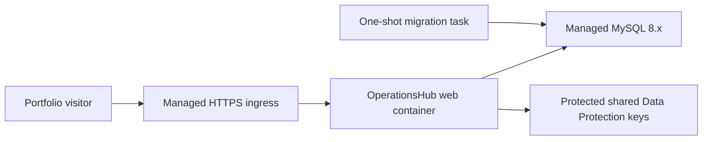

# Local container delivery and portfolio demonstrations

## Current hosting status

Azure and all other live-production hosting work is **Archived / not currently planned**. The hosted plan was deferred to avoid ongoing cloud costs for a portfolio project. It is not a prerequisite, a pending milestone, a required release step, or part of the definition of done.

Docker Compose is the supported way to run the complete application, including MySQL. A scheduled remote demonstration may temporarily expose the locally running web port through a Cloudflare Quick Tunnel. No repository workflow requires Azure credentials, Azure Container Registry (ACR), GitHub OIDC deployment, or a live environment.

## Local portfolio demonstration

The repository Compose project is the supported zero-SDK demonstration path. It builds the web image and runs the complete application:

```powershell
Copy-Item .env.example .env
docker compose up --build --detach
docker compose ps
```

Use `cp .env.example .env` on Linux, macOS, or WSL. Open `http://localhost:5090`. The `web` service waits for healthy MySQL, then Development startup applies EF Core migrations and initializes the disposable demo identities and portfolio scenario.

The Compose stack is local and disposable by design:

- `ASPNETCORE_ENVIRONMENT` is `Development`.
- The web container maps `${APP_PORT:-5090}` on the host to container port `8080`.
- `.env.example` contains known development credentials.
- TLS is disabled for the private Compose database connection, which explicitly allows MySQL public-key retrieval for the Development-only credentials.
- Data Protection keys are unencrypted files inside a private local named volume.

Do not publish this environment or its credentials. `docker compose down` stops the stack while preserving the named volumes. `docker compose down --volumes` also removes the database and Data Protection keys.

## Temporary scheduled remote demonstration

After both Compose services are healthy and `http://localhost:5090/health/ready` succeeds, start a Cloudflare Quick Tunnel in a separate terminal:

```bash
cloudflared tunnel --url http://localhost:5090
```

If `APP_PORT` overrides the default, use the mapped host port:

```text
cloudflared tunnel --url http://localhost:<web-port>
```

Share the generated random `https://...trycloudflare.com` URL only with the scheduled attendees. The tunnel is not a production deployment: it has no uptime guarantee, the URL changes on restart, and it works only while the demo laptop remains awake with Docker Compose and `cloudflared` running. Do not tunnel MySQL, publish the URL, share sensitive configuration, or leave Development-only accounts exposed beyond the controlled session.

Keep a short recorded walkthrough as a backup. Immediately after the demo, stop `cloudflared` with <kbd>Ctrl</kbd>+<kbd>C</kbd> and run `docker compose down`.

## Image contract

The root [Dockerfile](../Dockerfile) uses pinned .NET SDK and ASP.NET Core runtime versions. Its dependency-restore layer copies project files before source files for useful build caching. Publish re-evaluates restore inputs after the Razor and static assets are copied so the .NET 10 static-web-assets manifest includes the Blazor runtime. The final framework-dependent image runs as the .NET image's unprivileged application user, and its filesystem is read-only under Compose except for `/tmp` and the Data Protection key volume.

Build the image independently with:

```bash
docker build --tag operationshub-web:local .
```

The image:

- listens for HTTP on container port `8080`;
- writes structured JSON logs to standard output;
- handles `SIGTERM` through the ASP.NET Core host;
- provides a Docker health check that verifies `/health/live` and the Blazor framework script;
- accepts `--migrate` after the image name to apply EF migrations and exit;
- never initializes Development demo identities during `--migrate`;
- does not contain a connection string or other embedded secret.

Migration-only mode is verified by CI against a fresh disposable Compose database before the Development web host starts. CI confirms that migrations succeed without assigning the demo users reusable credentials or roles and without creating the portfolio request. It is also retained as a useful capability if the archived hosted design is reconsidered later; no live release currently uses it.

## Health endpoints

| Endpoint | Purpose | Dependency |
| --- | --- | --- |
| `/health/live` | Container liveness | Web process only |
| `/health/ready` | Local/CI readiness | MySQL connectivity |
| `/health` | Backward-compatible aggregate check | MySQL connectivity |

Use `/health/live` to distinguish a running web process from database availability. Use `/health/ready` before a local or temporary remote demonstration and in the Compose smoke test. Restarting a healthy web process cannot repair an unavailable database, so liveness deliberately excludes MySQL.

## Continuous integration and image publication

The repository's [GitHub Actions workflow](../.github/workflows/ci.yml) runs for every pull request and push to `main`. It provisions MySQL for the real-database integration tests, then restores, builds, tests, and format-checks the solution. The dependent container job builds the web image, starts a fresh Compose database, runs migration-only mode, verifies that Development demo initialization did not occur, starts the web host, and checks readiness, liveness, the landing page, and the Blazor framework asset. Its cleanup step always collects container logs and removes the disposable stack.

After those gates pass for a `main` push, the workflow publishes the image to GitHub Container Registry as `ghcr.io/<repository>:sha-<commit>` and `latest`. This is build-artifact publication, not deployment: no hosted environment consumes the image, and the workflow has no Azure credential, ACR, OIDC deployment, or live-environment step.

## Archived hosted-production option

**Status: Archived / not currently planned.** This material is retained only as architecture context in case cost and project goals change. It does not describe active resources or pending implementation.

The archived scope included Azure resource provisioning, ACR, Container Apps, Azure Database for MySQL, private VNet networking, Azure Files or another protected Data Protection key store, GitHub OIDC deployment, hosted smoke tests, and production rollback. No such resources are represented as active, and no setup instructions or credentialed deployment workflow are maintained.

The provider-neutral shape considered by that design was:



If this option is deliberately reactivated in the future, it would require a new decision and verified implementation for secret-managed TLS database connectivity, trusted proxy boundaries, persistent protected keys, Blazor WebSocket/session behavior, non-Development identity provisioning, backups, health-based release checks, and migration-compatible rollback. The former design contemplated migrating with an immutable image before switching traffic and retaining the previous image for application rollback; these are archived design notes, not current operational steps.
