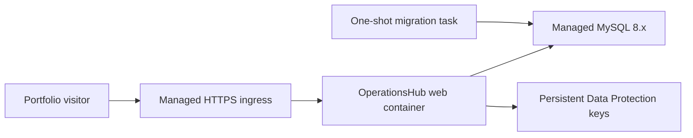

# Container delivery and deployment

## Local portfolio demonstration

The repository Compose project is the supported zero-SDK demonstration path. It builds the web image and runs the complete application:

```powershell
Copy-Item .env.example .env
docker compose up --build --detach
docker compose ps
```

Use `cp .env.example .env` on Linux, macOS, or WSL. Open `http://localhost:5090`. The `web` service waits for healthy MySQL, then Development startup applies EF Core migrations and initializes the disposable demo identities and portfolio scenario.

The Compose stack is intentionally local-only:

- `ASPNETCORE_ENVIRONMENT` is `Development`.
- MySQL and web ports are published to the host.
- `.env.example` contains known development credentials.
- TLS is disabled for the private Compose database connection, which explicitly allows MySQL public-key retrieval for the Development-only credentials.
- Data Protection keys are unencrypted files inside a private local named volume.

Do not expose this configuration to the internet. `docker compose down` stops the stack while preserving the named volumes. `docker compose down --volumes` also removes the database and Data Protection keys.

## Image contract

The root [Dockerfile](../Dockerfile) uses pinned .NET SDK and ASP.NET Core runtime versions. Its dependency-restore layer copies project files before source files for useful build caching. Publish re-evaluates restore inputs after the Razor and static assets are copied so the .NET 10 static-web-assets manifest includes the Blazor runtime. The final framework-dependent image runs as the .NET image's unprivileged application user, and its filesystem is read-only under Compose except for `/tmp` and the Data Protection key volume.

Build the image independently with:

```bash
docker build --tag operationshub-web:local .
```

The image:

- listens for HTTP on container port `8080`;
- writes structured JSON logs to standard output;
- handles `SIGTERM` through the ASP.NET Core host;
- provides a Docker health check that verifies `/health/live` and the Blazor framework script;
- accepts `--migrate` after the image name to apply EF migrations and exit;
- never initializes Development demo identities during `--migrate`;
- does not contain a connection string or other deployment secret.

## Health endpoints

| Endpoint | Purpose | Dependency |
| --- | --- | --- |
| `/health/live` | Container liveness | Web process only |
| `/health/ready` | Traffic readiness | MySQL connectivity |
| `/health` | Backward-compatible aggregate check | MySQL connectivity |

Use `/health/live` for a liveness probe and `/health/ready` for a readiness or post-deployment smoke test. Restarting a healthy web process cannot repair an unavailable database, so the liveness probe deliberately excludes MySQL. Production HTTPS redirection excludes `/health` paths so an orchestrator can probe the container's internal HTTP port; public application paths still redirect.

## Production deployment contract

The recommended public architecture is one web container revision behind a managed HTTPS ingress and a managed MySQL 8.x database:



Configure these values through the hosting platform, not a committed file:

| Setting | Requirement |
| --- | --- |
| `ASPNETCORE_ENVIRONMENT=Production` | Enables production error handling, HSTS, and HTTPS redirection |
| `ASPNETCORE_HTTP_PORTS=8080` | Matches the image's exposed HTTP port |
| `ConnectionStrings__OperationsHub` | Secret managed-MySQL connection string with deployment-appropriate TLS |
| `DataProtection__KeysPath` | Mounted persistent path, such as `/var/lib/operationshub/keys`, backed by encrypted storage |
| `ReverseProxy__TrustForwardedHeaders=true` | Only when a trusted ingress is the container's sole network path |

The forwarded-header option trusts the ingress-provided client IP and scheme headers. Enable it only when direct container access is blocked and the ingress removes untrusted forwarded headers. This allows HTTPS redirection, secure cookies, and rate limiting to observe the original public request correctly.

The filesystem key path is appropriate for a single replica or genuinely shared persistent storage when the platform encrypts that storage at rest and limits access to the application identity. For stronger key protection or multiple replicas, use a platform-specific external Data Protection provider; all replicas must share the same protected key ring or authentication cookies will fail when requests move between them. Interactive Server also requires WebSocket support and, for multiple replicas, session affinity or an intentional scale-out design. Start with one replica for the portfolio deployment.

## Release sequence

Build and tag an immutable image once. Use that exact image for both migration and web deployment.

1. Back up the managed database and retain the currently running image tag.
2. Run the new image as a one-shot task with `--migrate` and the production connection-string secret.
3. Start or update the web service with the same image digest.
4. Wait for `/health/ready`, then smoke-test the landing page and an authenticated workflow.
5. Route public traffic to the new revision.

A generic migration invocation is:

```bash
docker run --rm \
  --env ASPNETCORE_ENVIRONMENT=Production \
  --env 'ConnectionStrings__OperationsHub=<managed-secret-value>' \
  operationshub-web:<immutable-tag> --migrate
```

Use the platform's secret injection and one-shot job facility instead of putting the real value in shell history. The migration task exits nonzero if migration fails, preventing deployment from continuing.

For rollback, route traffic back to the retained image. Database migrations should remain backward-compatible with the previous application revision; do not automatically reverse a production migration. Restore a tested backup only when a forward fix is not safe.

## Public portfolio access

Container delivery makes the landing page easy to host at a stable HTTPS URL, but production authentication still needs an explicit decision. Public registration is disabled, and the known Development identities must never be deployed. Before sharing authenticated workflows publicly, add a restricted demo-identity or production identity-provisioning design with abuse controls and disposable data. Until then, a hosted production instance can expose the public landing page while authenticated features remain owner-controlled.

Provider-specific deployment manifests and CI/CD remain Milestone 6 follow-up work. They should be added only after a hosting provider is selected and the documented commands are verified against it.
